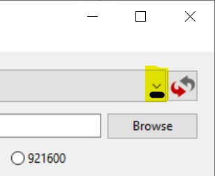

Instructions Linear Clock Setup

© Jonathan, Aliki, Nicolas, Astrid & Achim Fischer 2019

Install Windows Driver
======================

-   Open this link
    <https://github.com/acfischer42/Linear_Clock/raw/master/CH341SER_WINDOWS.zip>

-   Save to Downloads folder, open zip folder and run the file (double click)

-   If prompted by Windows Defender, click "yes".

Write Program to device:
========================

1.  Connect clock to a USB port of the PC (standard / old phone cable - type miniUSB)

2.  Download Firmware: open Link and save to Downloads folder.  
    <https://github.com/acfischer42/Linear_Clock/raw/master/LinearClock.nodemcu.v2.bin>

3.  Download Flash Tool: open Link and save to Downloads folder.  
    <https://github.com/acfischer42/Linear_Clock/raw/master/NodeMCU-PyFlasher-4.0-x86.exe>

-   Double Click to Run the program

1.  Start Flash Tool:

2.  In the upper right corner, click on the downwards facing arrow.

   And select *Auto-select* for the serial port

3.  Select Firmware that was downloaded in step 1:

4.  Keep Baud Rate and Flash Mode at default (115200, DIO)

5.  Select erase all

6.  Click on

The process will start.

**Unplug from PC and replug or plug into power supply**

Configure Device:
=================

1.  Use a PC/Laptop with Wireless adapter or disable Cellular Data on the phone.

2.  Power up the Clock

3.  Connect Wifi on pc/phone to IOT_AP

    1.  Password: 12345678

4.  Open a **new** internet browser tab. Enter address or click <a href="http://192.168.4.1" target="_blank">192.168.4.1</a> **Do NOT close this page**. You still want to follow the instruction...
    Your PC/phone might say that you need to log into the network before you can access the internet. Simply ignore that. It is normal that you don't have internet!

5.  Click on 2. Configure Wifi

6.  Enter your Wifi Name and password. Don't enter "SSID" preceding your wifi name.

7.  Click on Connect/Disconnect – Device will reboot and connect to your
    wireless network.

8.  You are done. It will take 30 sec for the Clock to reboot and set its time.

-  If you need to configure a time server (normally not needed)

1  Click on 1. configure Time.

2.  Enter Timezone (<https://www.timeanddate.com/worldclock/>)

3.  Enter Timeserver = us.pool.ntp.org or other eu. Ap.

4.  Click on Save Timesettings – you get automatically forwarded to the WIFI
    config page
