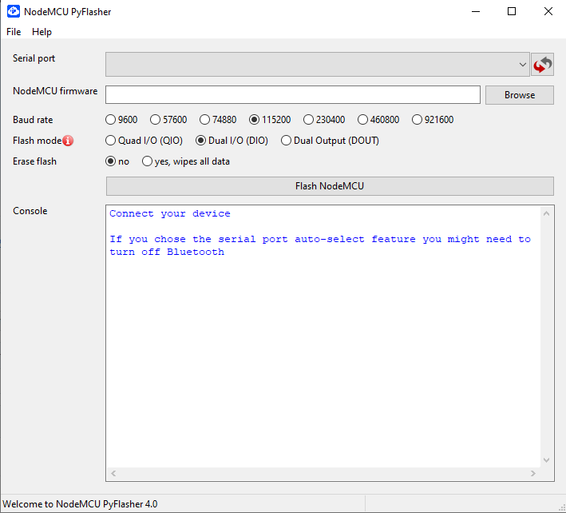
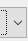
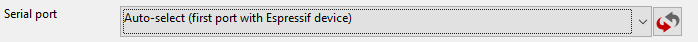
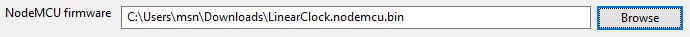
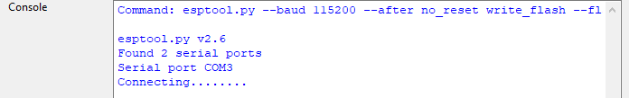
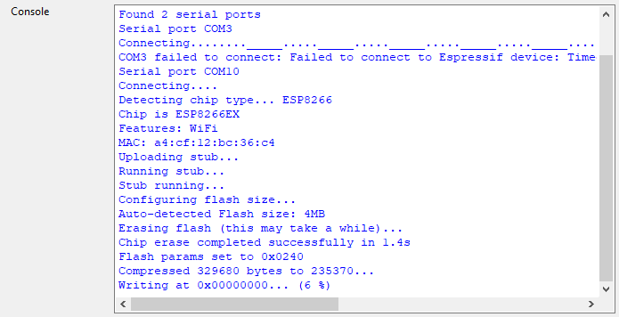
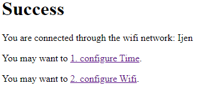
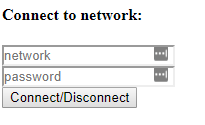
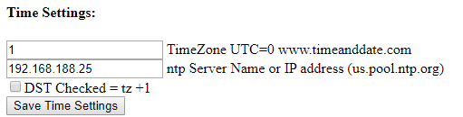

Instructions Linear Clock Setup

© Jonathan, Aliki, Nicolas, Astrid & Achim Fischer 2019

Install Windows Driver
======================

-   Open this link

<https://github.com/acfischer42/ESP8266/raw/Rheinturmuhr/LinearClock-release/CH341SER_WINDOWS.zip>

-   Save to Downloads folder and run (double click)

Write Program to device:
========================

1.  Connect clock to USB port of the PC

2.  Download Firmware: open Link and save to Downloads folder.  
    <https://github.com/acfischer42/ESP8266/raw/Rheinturmuhr/LinearClock-release/LinearClock.nodemcu.v2.bin>

3.  Download Flash Tool: open Link and save to Downloads folder.  
    <https://github.com/acfischer42/ESP8266/raw/Rheinturmuhr/LinearClock-release/NodeMCU-PyFlasher-4.0-x86.exe>

-   Double Click to Run the program

1.  Start Flash Tool:

1.  Click on

, select Auto-select for the serial port

1.  Select Firmware that was downloaded in step 1:

1.  Keep Baud Rate and Flash Mode at default (115200, DIO)

2.  Select erase all

1.  Click on

**Unplug from PC and replug or plug into power supply**

Configure Device:
=================

1.  Use a PC/Laptop with Wireless adapter or disable Cellular Data on the phone.

2.  Power up the Clock

3.  Connect Wifi on pc/phone to IOT_AP

    1.  Password: 12345678

4.  Open browser. Enter address <http://192.168.4.1>

5.  Click on 2. Configure Wifi

1.  Enter your Network SSID and password.

2.  Click on Connect/Disconnect – Device will reboot and connect to your
    wireless network.

3.  You are done

4.  If you need to configure a timeserver (normally not needed)

5.  Click on 1. configure Time.

1.  Enter Timezone (<https://www.timeanddate.com/worldclock/>)

2.  Enter Timeserver = us.pool.ntp.org or other eu. Ap.

3.  Click on Save Timesettings – you get automatically forwarded to the WIFI
    config page
